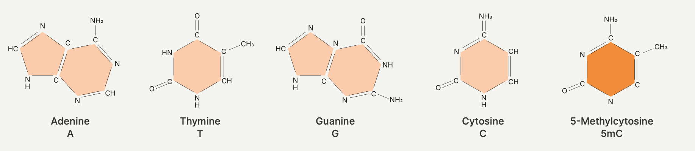
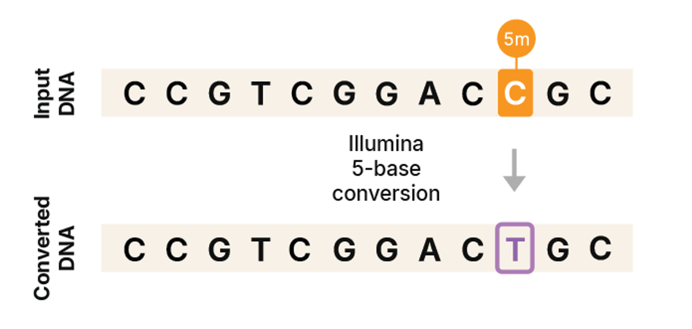
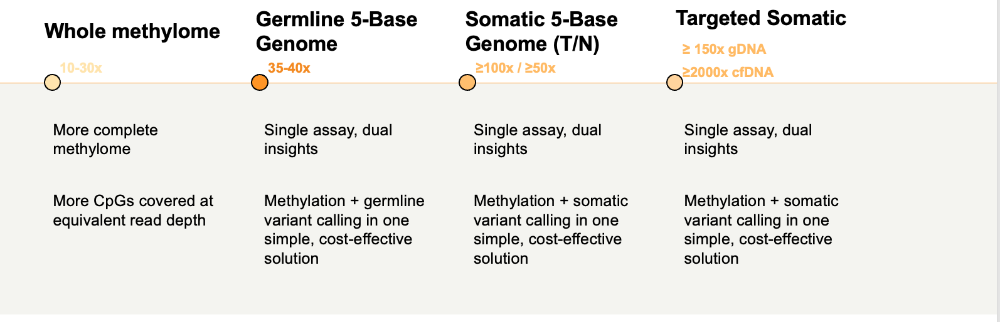
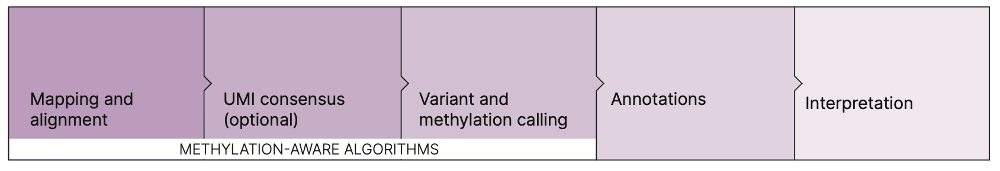

# The "5th base"
 
The 5-base genome measures the four standard bases plus methylated cytosine as a fifth base.

## Illumina 5-base conversion chemistry

## Sequencing coverage recommendations for different applications**

## 

*   48 samples/NovaSeq X 25B
*   18 samples/NovaSeq X 10B or NovaSeq 6000 S4 
*   3 samples/NovaSeq X 1.5B

## 生信分析

https://help.dragen.illumina.com/product-guide/dragen-v4.4/dragen-methylation-pipeline/dragen-5base-pipeline

Methylation (5mC), Germline and Somatic variants (SNVs, Indels, CNVs, SVs(future 4.5 release of DRAGEN))

参数设置: 
**--methylation-conversion=illumina**

默认分析: 
Methylation is primarily identified by reference C>T mismatches on the + strand, or G>A mismatches on the – strand.
目前5-base data is only compatible with **--methylation-protocol=directional**

Small Variant Calling: 
**--enable-variant-caller=true**

CNV Calling: 

        Germline CNV Calling (depth-based): Supported for WGS; not supported for WES
        Germline CNV Calling ASCN: Not supported
        Multisample Germline CNV Calling: Not supported
        Somatic CNV Calling ASCN: Supported for WGS; not supported for WES
        Somatic CNV Calling WES: Not supported
        Cytogenetics Modality: Not supported
        CNV with SV Support: Supported