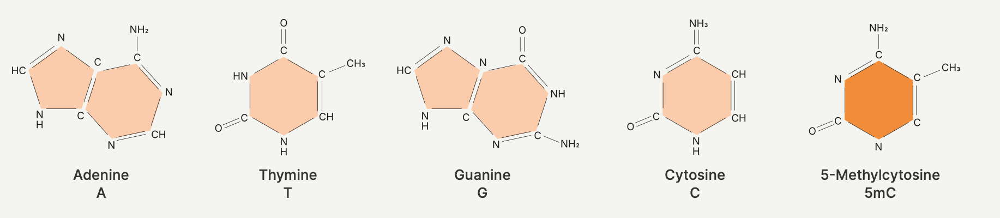
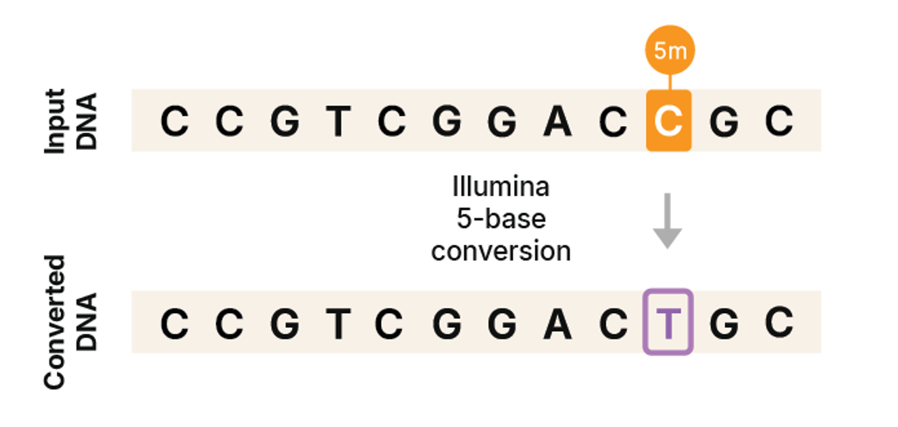
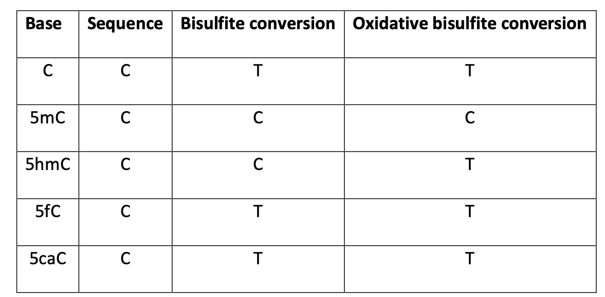
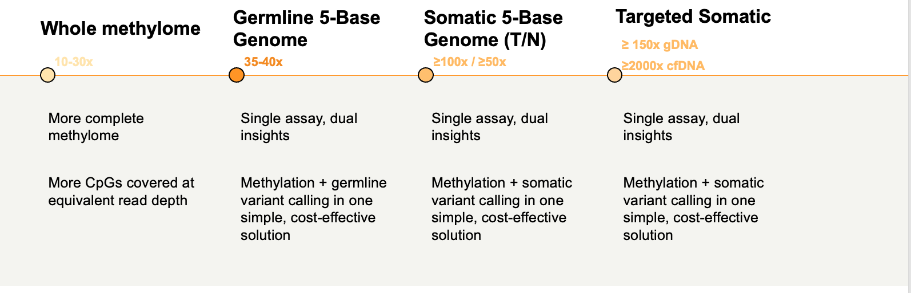
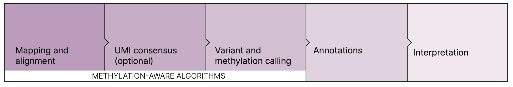
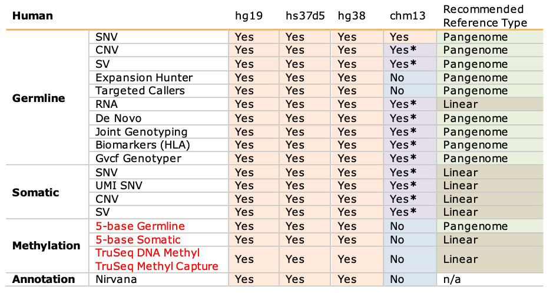
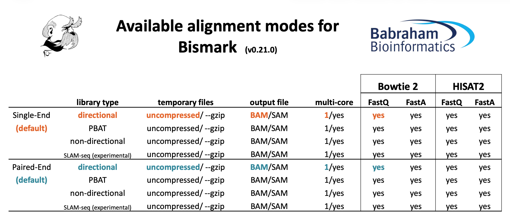
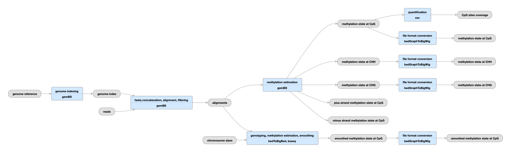
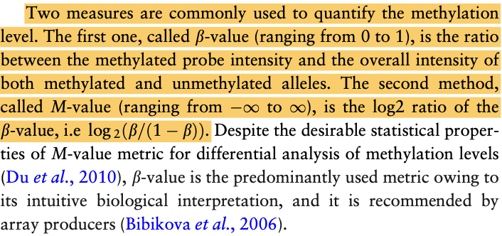
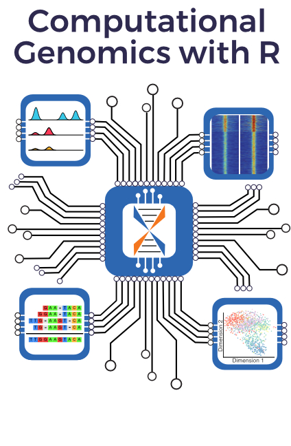

# The "5th base"

https://www.illumina.com/science/genomics-research/articles/5-base-solution.html

The 5-base genome measures the four standard bases plus methylated cytosine as a fifth base.

## Illumina 5-base conversion chemistry

## other Libraries

## Sequencing coverage recommendations for different applications

**500M paired-end reads for germline VC + Methylation:**

*   48 samples/NovaSeq X 25B
*   18 samples/NovaSeq X 10B or NovaSeq 6000 S4 
*   3 samples/NovaSeq X 1.5B

## 生信分析

https://help.dragen.illumina.com/product-guide/dragen-v4.4/dragen-methylation-pipeline/dragen-5base-pipeline

Methylation (5mC)

### 参数设置:
**--methylation-conversion=illumina**

### 默认分析:
Methylation is primarily identified by reference C>T mismatches on the + strand, or G>A mismatches on the – strand.
目前5-base data is only compatible with **--methylation-protocol=directional**

 Germline and Somatic variants (SNVs, Indels, CNVs, SVs)

### Small Variant Calling:
**--enable-variant-caller=true**

### CNV Calling:

        Germline CNV Calling (depth-based): Supported for WGS; not supported for WES
        Germline CNV Calling ASCN: Not supported
        Multisample Germline CNV Calling: Not supported
        Somatic CNV Calling ASCN: Supported for WGS; not supported for WES
        Somatic CNV Calling WES: Not supported
        Cytogenetics Modality: Not supported
        CNV with SV Support: Supported

### SVs(future 4.5 release of DRAGEN)

### Reference Support and Recommended Use for Human Data

### 分析时间:
1–4 hours(30× Germline–100×/30× T/N.)

### 不同类型的胞嘧啶甲基化
| 类型 | 序列模式 | 主要分布 | 生物学意义 |
| :--- | :--- | :--- | :--- |
| **CpG** | 5'-**C G**-3' | 哺乳动物基因组 | **主要的甲基化类型**，与基因沉默、基因组印迹、X染色体失空等密切相关。 |
| **CHG** | 5'-C **H G**-3' (H=A/T/C) | 植物基因组 | 在植物中与CpG甲基化共同维持转录转座子沉默。在哺乳动物某些细胞中有非典型存在。 |
| **CHH** | 5'-C **H H**-3' (H=A/T/C) | 植物基因组 | 在植物中通常甲基化水平较低，需要被持续建立，常用于防御病毒和转座子。 |

### 5-base 三级分析

ICM 5-Base:https://help.connected.illumina.com/dragen-5-base/tertiary-analysis/connected-multiomics-walkthrough

**对应的开源软件:**

Detect Differentially Methylated Regions (DMRs) Bioconductor package : 

Using DSS for BS-seq differential methylation analysis: https://www.bioconductor.org/packages/devel/bioc/vignettes/DSS/inst/doc/DSS.html#3_Using_DSS_for_BS-seq_differential_methylation_analysis

Analyzing WGBS data with bsseq: https://www.bioconductor.org/packages/release/bioc/vignettes/bsseq/inst/doc/bsseq_analysis.html

### 6-base genome:5-hydroxymethylcytosine (5hmC) 

在很长一段时间里，科学家认为DNA甲基化（5mC）是一个相对稳定的、最终的沉默标记。然而，在2009年，两个里程碑式的研究发现，5mC可以在TET家族酶的作用下被氧化成5hmC。

### 常规甲基化生物信息分析(初级分析)

[Gong T, Borgard H, Zhang Z, et al. Analysis and performance assessment of the whole genome bisulfite sequencing data workflow: currently available tools and a practical guide to advance DNA methylation studies[J]. Small Methods, 2022, 6(3): 2101251.](https://onlinelibrary.wiley.com/doi/abs/10.1002/smtd.202101251)

[nf-core/methylseq](https://github.com/nf-core/methylseq) is a bioinformatics analysis pipeline used for Methylation (Bisulfite) sequencing data. It pre-processes raw data from FastQ inputs, aligns the reads and performs extensive quality-control on the results.

| Step | Bismark workflow | bwa-meth workflow |
| :--- | :--- | :--- |
| Generate Reference Genome Index *(optional)* | Bismark | bwa-meth |
| Merge re-sequenced FastQ files | cat | cat |
| Raw data QC | FastQC | FastQC |
| Adapter sequence trimming | Trim Galore! | Trim Galore! |
| Align Reads | Bismark (bowtie2/hisat2) | bwa-meth |
| Deduplicate Alignments | Bismark | Picard MarkDuplicates |
| Extract methylation calls | Bismark | MethylDackel |
| Sample report | Bismark | - |
| Summary Report | Bismark | - |
| Alignment QC | Qualimap *(optional)* | Qualimap *(optional)* |
| Sample complexity | Preseq *(optional)* | Preseq *(optional)* |
| Project Report | MultiQC | MultiQC |

### 序列比对

| 特征 | 三字母法 (Three-letter) | 通配符法 (Wildcard) |
| :--- | :--- | :--- |
| **参考基因组处理** | 所有 C $\rightarrow$ T | 所有 C $\rightarrow$ Y (通配符) |
| **字母集** | A, G, T | A, G, T, Y |
| **主要比对算法** | BWT 回溯 | 哈希表 + 种子-延伸 |
| **序列复杂性** | 降低 | 维持（较高） |
| **比对模糊性** | 增加 | 降低 |
| **甲基化偏差** | 倾向于**低**估 | 倾向于**高**估 |
| **计算效率** | **更快**（优先考虑） | 较慢 |
| **代表工具** | Bismark, BWA-METH | BRAT\_BW, BSMAP, GSnap |

#### Bismark

#### bwa-meth
[bwa-meth:fast and accurate alignment of BS-Seq reads using bwa-mem and a 3-letter genome](https://github.com/brentp/bwa-meth)

[Pedersen B S, Eyring K, De S, et al. Fast and accurate alignment of long bisulfite-seq reads[J]. arXiv preprint arXiv:1401.1129, 2014.](https://arxiv.org/pdf/1401.1129)

### ENCODE (Encyclopedia of DNA Elements)

ENCODE (DNA 元件百科全书) 项目的核心目标是识别和描述人类基因组中的所有功能元件（如组蛋白修饰、DNA敏感性、转录因子结合位点等），这些功能元件在正常生理条件下是如何工作的。因此，ENCODE 的大部分原始样本数据确实来自正常（健康）的细胞和组织。

[Whole-Genome Bisulfite Sequencing Data Standards and gemBS-based Processing Pipeline:https://www.encodeproject.org/data-standards/wgbs-encode4/](https://www.encodeproject.org/data-standards/wgbs-encode4/)

**生物学重复:** 
two or more biological replicates，The CpG quantification should have a Pearson correlation of ≥0.8 for sites with ≥10X coverage. 

**测序要求：** 
30x

**测序读长:** 
The read length should be a minimum of 100 base pairs. 

**内参：** 
The pipeline maps against the lambda genome as a method of control.The C to T conversion rate should be ≥98% 

    外源对照DNA(Spike-in):在DNA样本中加入已知序列和完全未甲基化的人工DNA或噬菌体 DNA（如 λ phage DNA）。计算这些外源DNA中C到T的转化率，可以更准确地评估转化效率，因为它不受生物学甲基化模式的影响。
    线粒体DNA (mtDNA):由于线粒体DNA 在许多生物中通常是未甲基化的，因此可以用来估计转化率。

**quantify the methylation level**

**参考文献:** 
[Tsuji J, Weng Z. Evaluation of preprocessing, mapping and postprocessing algorithms for analyzing whole genome bisulfite sequencing data[J]. Briefings in bioinformatics, 2016, 17(6): 938-952.](https://academic.oup.com/bib/article/17/6/938/2606438)

### 甲基化分析高级分析

#### 1.初级分析输出:cytosine_report

| 字段 (Field) | 描述 (Description) |
| :--- | :--- |
| 染色体 (Chr) | 胞嘧啶位点所在的染色体或支架。 |
| 坐标 (Position) | 胞嘧啶位点在染色体上的位置（1-基）。 |
| 链 (Strand) | 胞嘧啶所在链的方向（+ 或 -）。 |
| **甲基化计数 (Methylated Count)** | 在该位置上，被读取为 **C**（即甲基化）的序列片段数量。 |
| **非甲基化计数 (Unmethylated Count)** | 在该位置上，被读取为 **T**（即非甲基化）的序列片段数量。 |
| 环境 (Context) | 胞嘧啶周围的两个碱基（如 CpG, CHG, CHH）。 |
| 三核苷酸 (Trinucleotide) | 胞嘧啶及其前后的碱基（用于更精细的环境分析）。 |
   
#### 2.生信软件

[methylKit](https://www.bioconductor.org/packages/release/bioc/html/methylKit.html):an R package for DNA methylation analysis and annotation from high-throughput bisulfite sequencing.

[genomation](https://www.bioconductor.org/packages/release/bioc/html/genomation.html):a toolkit to summarize, annotate and visualize genomic intervals.

loading the required packages.

    # Main analysis package
    library("methylKit")
    # Annotation package
    library("genomation")
    library("GenomicRanges")

Define the list containing the bismark coverage files

    file.list <- list(
       system.file("/path/to/test1.CX_report.txt.gz"),
       system.file("/path/to/test2.CX_report.txt.gz"),
       system.file("/path/to/ctrl1.CX_report.txt.gz"),
       system.file("/path/to/ctrl2.CX_report.txt.gz")
    )

read the listed files into a methylRawList object making sure the other,parameters are filled in correctly
    
    myobj=methRead(file.list,
               sample.id=list("test1","test2","ctrl1","ctrl2"),
               assembly="hg18",                                 #a string that defines the genome assembly such as hg18, mm9. 
               pipeline="bismarkCytosineReport",                #name of the alignment pipeline, it can be either "amp", "bismark","bismarkCoverage","bismarkCytosineReport" or a list (default:’amp’).
               treatment=c(1,1,0,0),
               context="CpG" ,                                  #methylation context string, ex: CpG,CHG,CHH, etc. (default:CpG)
               mincov=10,                                       #defaults to 10
               resolution="base"                                #allowed values ’base’ or ’region’. Default ’base
               )

For **gene annotation**, *select “Genes and Gene prediction tracks” from the “group” drop-down menu. Following that, select “Refseq Genes” from the “track” drop-down menu. Select “BED- browser extensible data” for the “output format”. Click “get output” and on the following page click “get BED” without changing any options. Save the output as a text file.*

    refseq_anot <- readTranscriptFeatures("/path/to/mm10.refseq.genes.bed")

For **CpG island annotation (200-bp regions typically 1 kb with a GC fraction greater than 0.5 and an observed-to-expected CpG ratio greater than 0.6)**, *select “Regulation” from the “group” drop-down menu. Following that, select “CpG islands” from the “track” drop-down menu. Select “BED- browser extensible data” for the “output format”. Click “get output” and on the following page click “get BED” without changing any options. Save the output as a text file.*

    cpg_anot <- readFeatureFlank("/path/to/mm10.cpg.bed", feature.flank.name = c("CpGi", "shores"), flank=2000)

## Resource

1.  [Computational Genomics with R](https://compgenomr.github.io/book/)

2.  [DNA Methylation: Bisulfite Sequencing Workflow](https://nbis-workshop-epigenomics.readthedocs.io/en/latest/content/tutorials/methylationSeq/Seq_Tutorial.html)

3.  [methylKit: User Guide](https://www.bioconductor.org/packages/release/bioc/vignettes/methylKit/inst/doc/methylKit.html)

4. [wgbstools - suite for DNA methylation sequencing data representation, visualization, and analysis](https://github.com/nloyfer/wgbs_tools)